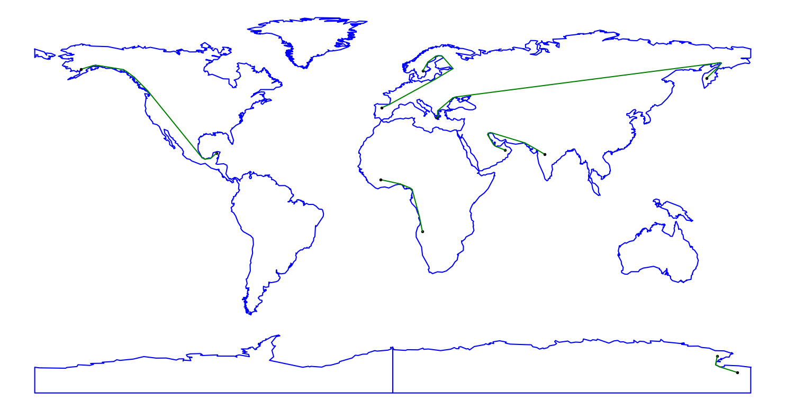

# Shortest path in polygons

Finds the shortest path between two points in a two-dimensional shape.

# Running

To run the project you will need Python 3.10 or later.
To install the necessary libraries run the following:

```bash
pip install -r requirements.txt
```

After that you can run the project as follows:

```bash
python -m main
```

After that a figure with most of the world map will appear which is an example 
of polygons.
On that figure you can click and the program will find and display the shortest
path between the places you clicked.



# Acknowledgements

- [mapbox/earcut](https://github.com/mapbox/earcut): A very fast triangulation JavaScript library that I converted in Python to use.
- [charliermarsh/point-location](https://github.com/charliermarsh/point-location): for the implementation of Kirkpatrick's algorithm.